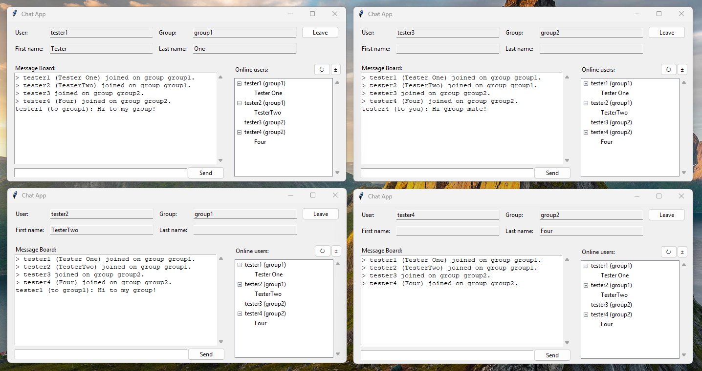

# Chat App

In this directory you will find the code for the Writing a Connext DDS Chat Application course.

This is the Python example that runs the GUI chat application using Connext DDS.

## Prerequisites

* Connext 7.3.0 or higher
* Python installation
* Python modules: venv, tkinter, tkinter-ttk

## Prepare your environment

We recommend using a python virtual environment for installing the Connext python API package.

1. Create the python virtual environment   
  Example command: `python -m venv <venv_name>`
1. Activate the venv  
  Example command: `source <venv_name>/bin/activate`
1. Install the Connext python API package  
  Example command: `python -m pip install rti.connext.activated -f <path/to/rti_connext_dds-7.3.0>/resource/python_api`

## Generate type code

Prior to executing the example, run the below command to generate the required python type code:

`rtiddsgen -language python -create typefiles <path/to/chat_app/python>/chat.idl`

## Run the example

With the virtual environment activated, execute the `app.py` file. This launches the GUI for one application.

`python app.py`

For evaluating with multiple applications and multiple groups, execute the `app.py` file multiple times.

In the below picture, we can see a total of four users in two different groups exchanging some messages:

## Software Architecture

The implementation follows a modular approach with simple decoupling.

The three relevant modules are:

* `app.py`: implements the main application business logic, which basically involves a simple bridge between the other two modules, applying any necessary data re-formatting.

* `dds_app.py`: implements the dds business logic, which involves creating and configuring the DDS entities, and the threads to monitor incoming DDS data such as for detecting new messages.

* `gui.py`: implements the GUI using python's built-in toolkit, Tkinter, which involves creating and configuring the graphical widgets as well as the logic to manage the state of the GUI.

These modules follow a simple approach to allow de-coupling, based on handlers and public methods.

This is illustrated in the below diagram, and explained further below.

| GUI                             | App      | DDS App                                  |
| ------------------------------- | -------- | ---------------------------------------- |
| **Handlers** (button presses)   |          | **Public methods** (DDS message trigger) |
| join                            | -------> | user_join                                |
| update_user                     | -------> | user_update_group                        |
| leave                           | -------> | user_leave                               |
| list_users                      | -------> | user_list                                |
| send_message                    | -------> | message_send                             |
|                                 |          |                                          |
| **Public methods** (update GUI) |          | **Handlers** (DDS message received)      |
| user_joined                     | <------- | users_joined                             |
| user_left                       | <------- | users_dropped                            |
| message_received                | <------- | message_received                         |

### Handlers

The `dds_app` and the `gui` expose handlers that the main application is expected to install.

They are described in the `Handlers` class in each module.

These handlers are executed to notify the `app` of any event in each respective module - for example:

* `dds_app` exposes the `users_joined` handler, which gets executed when `dds_app` receives a DDS message indicating a new user has joined the domain.

* `gui` exposes the `join` handler, which gets executed when the "Join" button in the GUI is pressed.

Note: the handlers are *unimplemented* by default, which allows the main application to install only those handlers that it is interested in.

### Public methods

The `dds_app` and the `gui` expose public methods that the main application is expected to execute.

Following common python convention, they are those methods that do not begin with an underscore.

These public methods are executed to notify the `dds_app` and the `gui` of any relevant changes and/or to drive some action in their logic - for example:

* `dds_app` exposes the `message_send` public method, which the application executes when wanting to send a message via the DDS domain.

* `gui` exposes the `message_received` public method, which the application executes to indicate the GUI to display a new message.

### Bridging

With this approach, the main application has the simple job of installing the handlers from each module and *connecting* them to the public methods of the other module - for example: 

1. `app` installs the `joined` handler in the `dds_app` to its own `app.joined` method, which gets executed when the `dds_app` receives a DDS message about a user joining the domain.

2. The `app.joined` method applies any data re-formatting necessary, de-coupling the DDS types used by the `dds_app` from the types used by the `gui`.

3. The `app.joined` method then executes the `user_joined` public method exposed by the `gui`, effectively *connecting* the notification from the `dds_app` to trigger a `gui` update.
